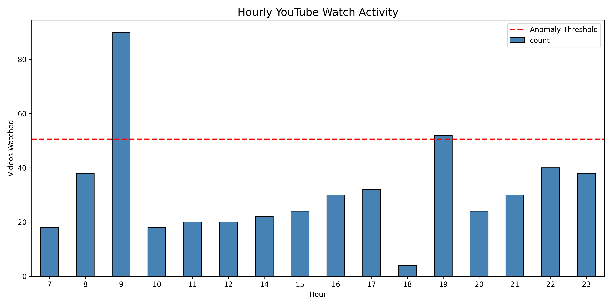
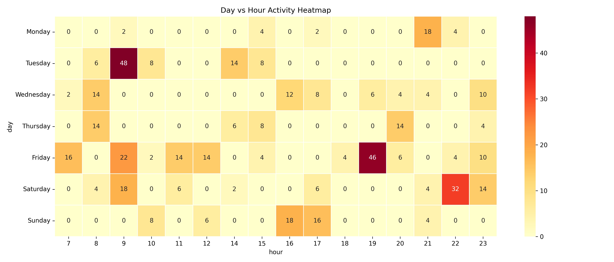
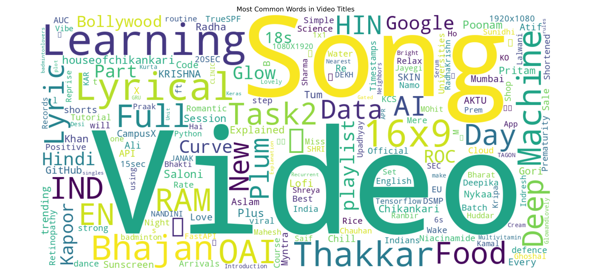

# 📺 YouTube Watch History Analytics


A Python-based data analytics project that extracts, preprocesses, and analyzes **YouTube Watch History** exported from **Google Takeout** to uncover user viewing patterns, content preferences, and advertisement-related anomalies using Exploratory Data Analysis (EDA), statistical analysis, and data visualization techniques.

---

## 📌 Project Overview

This project analyzes YouTube Watch History data exported from Google Takeout in HTML format. The raw data is parsed, cleaned, transformed, and analyzed to identify user behavior patterns, viewing trends, and advertisement-related anomalies.

The project demonstrates an end-to-end data analytics workflow including data extraction, preprocessing, feature engineering, statistical anomaly detection, visualization, and automated report generation using Python.

---

## ✨ Features

- 📂 Parses YouTube Watch History HTML exported from Google Takeout using BeautifulSoup
- 🧹 Cleans and preprocesses raw watch history data
- ⏰ Extracts temporal features such as hour, day, date, and time category
- 📊 Performs behavioral pattern analysis
- 📢 Identifies advertisement-related entries
- 🚩 Detects anomalous viewing activity using Mean + Standard Deviation
- 🏷️ Categorizes watched content into predefined categories
- ☁️ Generates a Word Cloud of frequently occurring video titles
- 📈 Creates multiple visualizations for behavioral analysis
- 📄 Automatically exports reports and cleaned datasets

---

## 📊 Visualizations

The project generates the following visualizations:

- 📈 Hourly YouTube Activity
- 📅 Weekly Activity Analysis
- 🔥 Day vs Hour Activity Heatmap
- 🕒 Watch Distribution by Time of Day
- 📢 Advertisement Distribution
- ⏰ Advertisement Distribution by Time Category
- 🏷️ Content Category Distribution
- ☁️ Word Cloud of Video Titles
- 🚩 Most Frequently Appearing Advertisement Entries

---

## 🛠️ Technologies Used

- Python
- Pandas
- BeautifulSoup (HTML Parsing)
- Matplotlib
- Seaborn
- WordCloud
- Regular Expressions (Regex)
- Google Takeout (Dataset Export)

---

## 📂 Project Structure

```text
youtube-watch-history-analytics/
│
├── data/
│   └── sample_data.txt
│
├── outputs/
│   ├── analysis_summary.txt
│   ├── anomaly_report.csv
│   ├── youtube_watch_history_cleaned.csv
│   └── Generated visualizations
│
├── screenshots/
│   └── Project screenshots
│
├── src/
│   └── youtube_analysis.py
│
├── requirements.txt
└── .gitignore
```

---

## ⚙️ Installation

### 1. Clone the repository

```bash
git clone https://github.com/TamannaBhatt/youtube-watch-history-analytics.git
```

### 2. Navigate to the project

```bash
cd youtube-watch-history-analytics
```

### 3. Install dependencies

```bash
pip install -r requirements.txt
```

### 4. Export your YouTube Watch History

Download your watch history from **Google Takeout**.

Place the exported file named:

```text
watch-history.html
```

inside the **data/** folder.

### 5. Run the project

```bash
python src/youtube_analysis.py
```

---

## 🔄 Workflow

```text
YouTube Watch History (HTML)
            │
            ▼
      Data Collection
            │
            ▼
      Data Extraction
            │
            ▼
Data Cleaning & Preprocessing
            │
            ▼
    Feature Engineering
            │
            ▼
Behavior Pattern Analysis
            │
            ▼
 Advertisement Detection
            │
            ▼
 Statistical Anomaly Detection
            │
            ▼
    Data Visualization
            │
            ▼
 Reports & Insights
```
---

## ⚡ How It Works

1. The project reads the `watch-history.html` file exported from Google Takeout.
2. BeautifulSoup parses the HTML and extracts video titles, timestamps, and advertisement metadata.
3. The extracted data is cleaned and converted into a structured Pandas DataFrame.
4. Temporal features are created to analyze viewing behavior.
5. Statistical methods identify unusually high viewing activity.
6. Multiple visualizations and reports are generated automatically.
---

## 📁 Generated Outputs

The project automatically generates:

- ✅ Cleaned YouTube Watch History Dataset (CSV)
- ✅ Analysis Summary Report
- ✅ Advertisement Anomaly Report
- ✅ Multiple Visualization Charts
- ✅ Word Cloud
- ✅ Activity Heatmap
- ✅ Behavioral Analysis Graphs

---

## 🖼️ Visualization Results

### Hourly Activity Analysis



---

### Day vs Hour Activity Heatmap



---

### Word Cloud



---


## 📌 Key Insights

- Evening hours showed the highest user viewing activity.
- Advertisement entries accounted for approximately 24% of the watch history.
- Behavioral patterns were successfully extracted using temporal feature engineering.
- Statistical anomaly detection identified unusually high viewing activity based on hourly watch counts.
- Visualization techniques helped reveal user engagement trends and advertisement frequency.

---

## 🔮 Future Improvements

- Machine Learning-based anomaly detection using Isolation Forest or One-Class SVM
- Interactive dashboard using Streamlit or Plotly Dash
- NLP-based automatic video categorization
- Support for multiple Google Takeout exports
- Time-series trend analysis
- Personalized viewing analytics dashboard

---

## 🔒 Privacy Notice

This repository intentionally excludes personal YouTube Watch History data to protect user privacy. Users should export their own watch history using Google Takeout and place the `watch-history.html` file inside the `data/` directory before running the project.

---

## 👨‍💻 Author

**Tamanna Bhatt**

B.Tech in Computer Science & Engineering (Artificial Intelligence & Machine Learning)

GitHub: **[@TamannaBhatt](https://github.com/TamannaBhatt)**

---

## 📜 License

This project is licensed under the **MIT License**.

---

⭐ **If you found this project useful, consider giving it a Star!**
